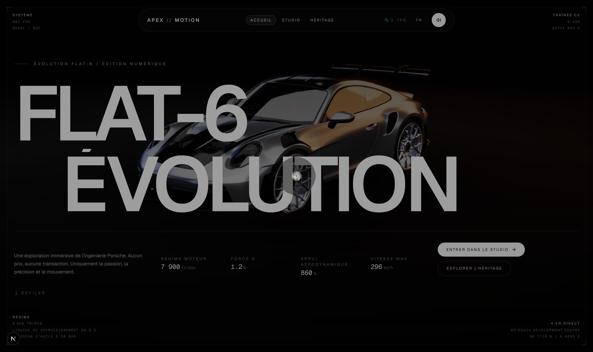
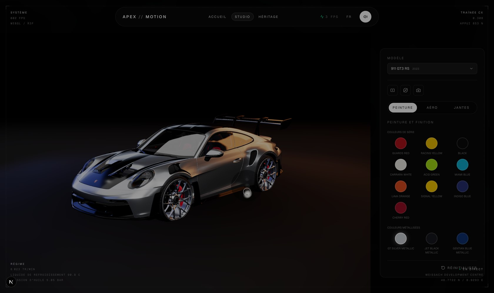
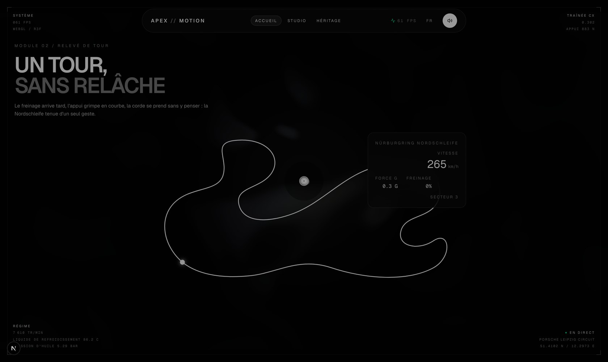
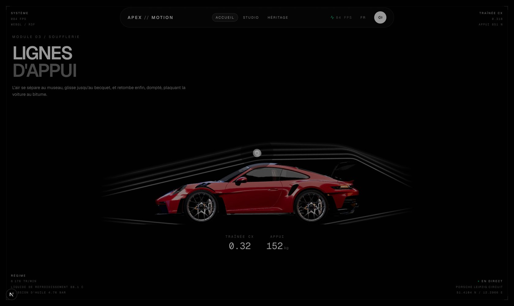
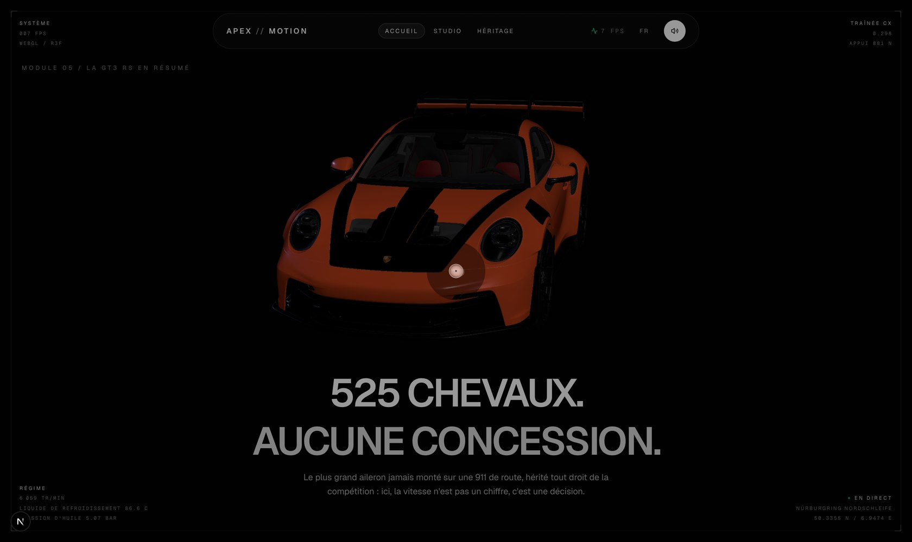
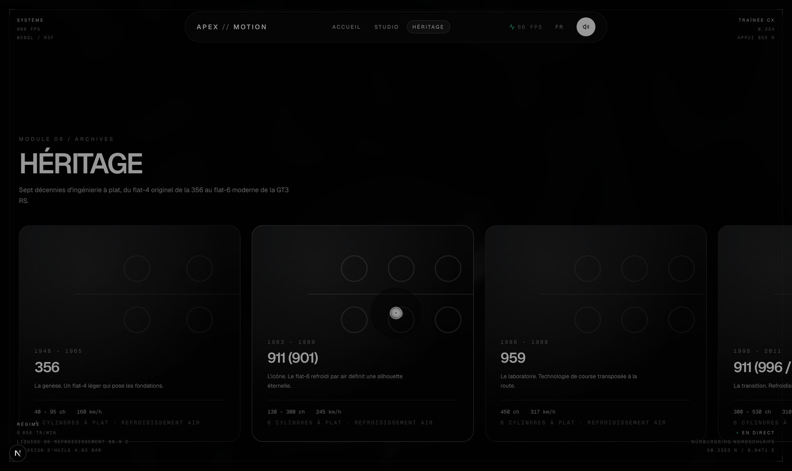

<div align="center">

# APEX // MOTION

**Une exploration numérique immersive de l'ingénierie Porsche.**
Studio de personnalisation 3D en temps réel, télémétrie de circuit et archives héritage.

Projet indépendant, non affilié à Porsche.

[](https://nextjs.org)
[](https://react.dev)
[](https://www.typescriptlang.org)
[](https://docs.pmnd.rs/react-three-fiber)
[](https://tailwindcss.com)

</div>

---

## Sommaire

- [Vision](#vision)
- [Aperçu visuel](#aperçu-visuel)
- [Stack technique](#stack-technique)
- [Architecture du projet](#architecture-du-projet)
- [Démarrage](#démarrage)
- [Scripts disponibles](#scripts-disponibles)
- [Parcours du site](#parcours-du-site)
- [Direction artistique](#direction-artistique)
- [Couche cinématographique WebGL](#couche-cinématographique-webgl)
- [Séquence d'entrée](#séquence-dentrée)
- [Curseur et conception sonore](#curseur-et-conception-sonore)
- [Architecture de performance](#architecture-de-performance)
- [Internationalisation](#internationalisation)
- [Intégration et déploiement continus](#intégration-et-déploiement-continus)
- [Feuille de route](#feuille-de-route)
- [Mentions](#mentions)

---

## Vision

APEX // MOTION est un projet indépendant dédié à la mise en scène digitale de
l'ingénierie Porsche. Le site adopte une esthétique brutaliste-luxe : noir abyssal,
typographie éditoriale surdimensionnée, télémétrie de cockpit épinglée aux angles, et
une caméra 3D à ressort qui répond à chaque interaction.

## Aperçu visuel

<table>
<tr>
<td width="50%"><br /><sub>Page d'accueil : le hero cinématique</sub></td>
<td width="50%"><br /><sub>Studio : personnalisation temps réel</sub></td>
</tr>
<tr>
<td width="50%"><br /><sub>Relevé de tour : Nürburgring Nordschleife</sub></td>
<td width="50%"><br /><sub>Soufflerie : lignes d'appui</sub></td>
</tr>
<tr>
<td width="50%"><br /><sub>Assemblage de particules : révélation finale</sub></td>
<td width="50%"><br /><sub>Héritage : sept décennies de flat-6</sub></td>
</tr>
</table>

## Stack technique

| Domaine         | Choix                                                                                                                                    | Rôle                                                                   |
| --------------- | ---------------------------------------------------------------------------------------------------------------------------------------- | ---------------------------------------------------------------------- |
| Framework       | [Next.js 16](https://nextjs.org) (App Router) + React 19 + TypeScript                                                                    | SPA fluide, routage par modules                                        |
| Style           | [Tailwind CSS v4](https://tailwindcss.com)                                                                                               | Design system utilitaire, thème sombre natif                           |
| Scroll          | [Lenis](https://github.com/darkroomengineering/lenis)                                                                                    | Inertie de scroll fluide et pesée                                      |
| Animation       | [GSAP](https://gsap.com) (ScrollTrigger) + [Framer Motion](https://www.framer.com/motion)                                                | Chorégraphies éditoriales et micro-états d'interface                   |
| 3D / WebGL      | [Three.js](https://threejs.org) via [React Three Fiber](https://docs.pmnd.rs/react-three-fiber) + [drei](https://github.com/pmndrs/drei) | Flotte de modèles `.glb` réels, matériaux dynamiques, caméra à ressort |
| Post-traitement | [@react-three/postprocessing](https://github.com/pmndrs/react-postprocessing)                                                            | Bloom, aberration chromatique, grain, vignette, tone mapping ACES      |
| Pipeline 3D     | [glTF-Transform](https://gltf-transform.dev) + Draco                                                                                     | Optimisation et compression des modèles source                         |
| Audio           | Web Audio API (synthèse temps réel)                                                                                                      | Retours sonores d'interface synthétisés, aucun fichier son             |
| Icônes          | [lucide-react](https://lucide.dev)                                                                                                       | Iconographie fine, aucune émoji                                        |
| Qualité         | ESLint, Prettier, TypeScript strict                                                                                                      | Portes de qualité en intégration continue                              |

## Architecture du projet

```
apex-motion/
├── .github/
│   ├── workflows/ci.yml         # Types, lint, format, build
│   ├── workflows/deploy.yml     # Déploiement Vercel en production
│   └── dependabot.yml           # Mises à jour groupées des dépendances
├── app/                         # Routes App Router (SPA à modules)
│   ├── layout.tsx               # Providers, grain, curseur, HUD, navigation
│   ├── template.tsx             # Transitions de page (Framer Motion)
│   ├── favicon.ico              # Chevron Apex sur noir abyssal
│   ├── page.tsx                 # Page d'accueil (assemble les sections)
│   ├── configurator/            # Studio de personnalisation 3D
│   ├── heritage/                # Frise chronologique héritage
│   └── silhouette-capture/      # Outil interne de capture de silhouettes
├── components/
│   ├── layout/                  # Navbar, Footer, Preloader, HudFrame, scroll
│   ├── ui/                      # CustomCursor, GlassPanel, TelemetryTag, SectionLabel
│   ├── three/                   # Scène 3D, éclairage animé, caméra, post-traitement
│   ├── configurator/            # Panneau de configuration temps réel
│   └── sections/                # Sections de la page d'accueil
├── hooks/                       # useFPS, useRenderGate, useScrollReveal, useMagneticHover, ...
├── lib/
│   ├── i18n/                    # Dictionnaires FR/EN/DE et provider de langue
│   ├── audio/                   # Provider audio et conception sonore synthétisée
│   ├── intro/                   # État de la séquence d'entrée
│   ├── debug/                   # Panneau de debug interne
│   ├── capture/                 # Provider de capture d'écran du studio
│   ├── three/                   # Configs de flotte, textures procédurales, nuage de particules
│   └── configurator/            # État et types du configurateur (peintures, jantes, étriers)
├── scripts/                     # Pipeline d'assets (Node, hors build Next.js)
│   ├── optimize-models.mjs      # Compression Draco + hash des modèles .glb
│   ├── capture-fleet-images.mjs # Génère les silhouettes .webp de la flotte
│   ├── capture-aero-hero.mjs    # Capture la scène héro de la soufflerie
│   └── extract-particle-points.mjs # Génère le nuage de points depuis le mesh GT3 RS
├── public/
│   ├── models/                  # Flotte Porsche au format .glb (7 véhicules)
│   ├── particles/                # Nuage de points binaire (assemblage de particules)
│   ├── silhouettes/              # Silhouettes .webp pré-rendues
│   └── draco/                    # Décodeur Draco local
├── screenshots/                  # Captures utilisées dans ce README
└── utils/                        # Fonctions utilitaires (cn)
```

## Démarrage

Prérequis : Node.js 20 ou supérieur.

```bash
npm install
npm run dev
```

L'application est servie sur [http://localhost:3000](http://localhost:3000).

## Scripts disponibles

| Commande                    | Description                                               |
| --------------------------- | --------------------------------------------------------- |
| `npm run dev`               | Serveur de développement (Turbopack)                      |
| `npm run build`             | Build de production                                       |
| `npm run start`             | Sert le build de production                               |
| `npm run typecheck`         | Vérification TypeScript stricte                           |
| `npm run lint`              | Analyse ESLint                                            |
| `npm run format`            | Formatage Prettier                                        |
| `npm run format:check`      | Vérifie le formatage sans modifier                        |
| `npm run optimize:models`   | Compresse et hash les modèles `.glb` sources              |
| `npm run capture:fleet`     | Régénère les silhouettes `.webp` de la flotte             |
| `npm run capture:aero`      | Recapture la scène héro de la section soufflerie          |
| `npm run extract:particles` | Régénère le nuage de points de l'assemblage de particules |

## Parcours du site

### Accueil (`/`)

Huit modules qui s'enchaînent au défilement, chacun piloté par son propre
`ScrollTrigger` :

1. **Hero** : la GT3 RS 2023 en scène cinématique, régime moteur et force G en direct.
2. **Kinetic Statement** : typographie éditoriale géante en `mix-blend-difference`.
3. **Configurator Teaser** : une 911 classique tourne lentement, invitation vers le Studio.
4. **Lap Telemetry** : un tracé de la Nordschleife se dessine au scroll, vitesse et freinage en direct.
5. **Aero Flow** : soufflerie stylisée, lignes de flux, traînée Cx et appui aérodynamique.
6. **Silhouette Evolution** : sept silhouettes Porsche, du 917K à la GT3 RS, se morphent l'une dans l'autre.
7. **Particle Assembly** : un nuage de ~41 000 points se disperse puis se reforme en GT3 RS Lava Orange, jantes Satin Black et étriers Guards Red.
8. **Studio Outro** : écran de sortie, lien direct vers le Studio.

### Studio (`/configurator`)

Le cœur technique du projet : une GT3 RS `.glb` réelle, personnalisable en temps réel.

- **Peinture et finition** : 45 teintes (série, métallisées, satinées, mates, Paint to
  Sample), regroupées comme chez un vrai configurateur constructeur. Le matériau
  interpole en continu vers la cible plutôt que de sauter.
- **Aéro** : aileron amovible, animé sur sa propre charnière.
- **Jantes et freinage** : quatre finitions de jante (Silver, Satin Black, Weissach Gold,
  Titanium) et six couleurs d'étrier (PCCB, Guards Red, noir, bleu, argent, blanc).
- **Caméra** : trois angles pré-réglés (extérieur, arrière, jantes), ressort amorti plutôt
  que coupe sèche, léger parallaxe au pointeur.
- **Comparateur avant/après** : capture l'état courant en image figée pour comparer un
  changement avec le look précédent.
- **Visualiseur plein écran** : orbite libre autour du build en cours.
- **Export HD** : capture le canvas WebGL en PNG haute résolution, au-delà de la
  définition d'affichage.
- **Multi-véhicules** : bascule entre les sept modèles de la flotte (356 à Mission R en
  passant par la 917K, la 918 Spyder et la GT3 RS) via `CarSwitcher`.

### Héritage (`/heritage`)

Une frise chronologique pilotée par GSAP ScrollTrigger, retraçant sept décennies
d'ingénierie flat-6, de la 356 originelle (1948) à la 911 GT3 RS 992 moderne, avec
fiche technique (puissance, vitesse max, refroidissement) pour chaque ère.

## Direction artistique

- **Fond** : noir abyssal (`#020202`), surfaces charbon, bordures rasoir (`border-white/10`).
- **Typographie** : titres éditoriaux surdimensionnés et resserrés (`tracking-tighter`),
  fusionnés en `mix-blend-difference` pour s'inverser au passage de la carrosserie.
  Métadonnées de télémétrie minuscules et espacées (`tracking-widest`, `text-[10px]`).
- **HUD** : cadre en filet et blocs de télémétrie épinglés aux quatre angles (FPS, Cx,
  appui, régime, température), à la manière d'un tableau de bord aérospatial.
- **Grain et lignes de balayage** : une turbulence SVG animée et un léger scanline
  recouvrent toute la page pour casser l'aspect « écran plat numérique ».
- **Iconographie** : `lucide-react` exclusivement, aucune émoji.
- **Favicon** : un chevron Apex minimaliste au-dessus d'une ligne de trajectoire, en
  écho à la scission `//` du logotype, lisible jusqu'à 16 px.

## Couche cinématographique WebGL

Le pipeline de post-traitement est mutualisé dans `components/three/CinematicEffects.tsx`
et décliné en deux réglages :

- `hero` : bloom appuyé et grain marqué, la scène se lit comme une pellicule.
- `studio` : rendu plus net, pour que les changements de matériaux restent lisibles.

La chaîne enchaîne **Bloom** (débordement des lumières de contour), **aberration
chromatique**, **bruit animé**, **vignette** et **tone mapping ACES Filmic** afin que les
hautes lumières ne saturent pas en blanc plat.

L'éclairage combine trois softbox (`rectAreaLight` : clé, remplissage froid, contre-jour
chaud) et un projecteur qui orbite lentement autour de la voiture, de sorte que les reflets
sur la carrosserie ne sont jamais figés.

### Réalisme des matériaux

Les reflets qui rendent une peinture crédible ne viennent pas des lampes, mais de ce que la
peinture voit. La scène fabrique donc son propre environnement : des bandes émissives
(`Lightformer`) disposées comme un studio photo réel, cuites une seule fois dans une cubemap
de 256 px, sans aucun téléchargement. Ce sont ces bandes qui produisent la traînée lumineuse
caractéristique le long du flanc.

S'y ajoutent, dans `lib/three/textures.ts`, des cartes générées au chargement dans un canvas
hors écran plutôt que téléchargées :

- une **carte de normales carbone**, tissage sergé 2x2, appliquée aux pièces aéro ;
- une **carte de normales de vernis** de très faible amplitude, qui reproduit la peau
  d'orange d'une vraie laque et empêche la carrosserie de ressembler à du plastique moulé.

Les finitions mates reçoivent un vernis diffus, les finitions brillantes un vernis mouillé,
et la transition entre les deux est interpolée image par image.

### Force G de la caméra

Au-delà du ressort, deux effets donnent le poids : le champ de vision s'élargit avec la
vitesse, comme l'accélération comprime la perception d'un couloir, et la caméra s'incline
dans les déplacements latéraux comme un châssis penche dans une épingle. Les deux reviennent
au neutre à mesure que le ressort se stabilise.

## Séquence d'entrée

Le préchargeur affiche un compteur au dixième de pourcent, une grille technique dont les
cellules s'allument comme une matrice de capteurs, et les étapes de mise en route. Il
attend réellement `document.fonts.ready` avant d'atteindre 100 %, la barre plafonnant tant
que les polices ne sont pas décodées. Sur `/`, le modèle GT3 RS et le nuage de particules
sont préchargés en tâche de fond pendant cette séquence.

L'entrée est volontairement un clic. C'est le geste que les navigateurs exigent pour
débloquer l'audio, ce qui permet de faire du démarrage moteur le tout premier son de
l'expérience. Le rideau s'ouvre alors en deux moitiés et l'animation du Hero est libérée sur
le même temps, de sorte que les deux mouvements n'en forment qu'un.

## Curseur et conception sonore

Le curseur natif est remplacé par un anneau creux qui interpole vers le pointeur, se dilate
et s'aimante vers tout élément portant l'attribut `data-cursor`, dont il affiche le libellé
contextuel. Tout le travail par image est fait en mutation DOM directe : React ne se
re-rend jamais sur un déplacement de souris. Le curseur est désactivé sur les pointeurs
grossiers (tactile).

`lib/audio/soundDesign.ts` synthétise toutes les réponses tactiles à la volée, sans aucun
fichier audio dans le bundle. Un clic métallique est construit sur des partiels
inharmoniques au-dessus d'un souffle filtré, car c'est l'inharmonicité qui fait entendre du
métal plutôt que du bois. Le démarrage enchaîne quelques impulsions de démarreur avant la
descente résonante en sous-graves. Un compresseur en sortie évite que des sons empilés ne
saturent.

## Architecture de performance

- **Rendu conditionné à la visibilité** : `hooks/useRenderGate.ts` combine un
  `IntersectionObserver` et l'état de visibilité de l'onglet. Une scène hors écran passe en
  `frameloop="never"`, donc à zéro travail GPU, au lieu de calculer des images que personne
  ne regarde.
- **Résolution adaptative** : `PerformanceMonitor` abaisse le plafond de `dpr` quand la
  cadence faiblit et le relève quand elle revient, ce qui préserve la fluidité plutôt que la
  définition.
- **Modèles optimisés** : la flotte `.glb` passe par `glTF-Transform` + Draco
  (`npm run optimize:models`), et chaque fichier est versionné par un hash de contenu dans
  son nom pour un cache HTTP immuable.
- **Chargement différé** : les sections lourdes en JS sous la ligne de flottaison (`AeroFlow`,
  `SilhouetteEvolution`, `ParticleAssembly`, `StudioOutro`) sont scindées via `next/dynamic`,
  sans perte de SSR.
- **Une seule boucle rAF pour le défilement** : GSAP pilote Lenis, au lieu de deux boucles
  concurrentes. C'est la source habituelle de saccades sur les animations liées au scroll,
  supprimée par construction.
- **HUD sans re-rendu** : le tableau de bord écrit directement dans le DOM depuis une boucle
  unique, un affichage rafraîchi soixante fois par seconde ne coûte donc rien à React.
- **Mouvement réduit respecté** : `prefers-reduced-motion` désactive l'interpolation de
  défilement, le grain animé et le rideau d'entrée.

## Internationalisation

Le projet est multilingue dès l'origine (`lib/i18n`). Le français est la langue par défaut ;
l'anglais et l'allemand sont disponibles via le sélecteur de langue dans la navigation, qui
fait défiler les trois locales. Ajouter une langue consiste à étendre `dictionaries.ts` avec
un nouveau bloc de traductions typées.

## Intégration et déploiement continus

**`ci.yml`** se déclenche sur chaque push et pull request vers `main` :

1. **Qualité** : `typecheck`, `lint`, `format:check`.
2. **Build** : build de production Next.js, avec cache `.next/cache` réutilisé entre les
   exécutions, puis dépôt de l'artefact.

**`deploy.yml`** déploie sur Vercel à chaque push sur `main`. Le job se met en veille
proprement si le secret `VERCEL_TOKEN` est absent, ce qui laisse les forks fonctionnels.
Secrets attendus : `VERCEL_TOKEN`, `VERCEL_ORG_ID`, `VERCEL_PROJECT_ID`.

**`dependabot.yml`** regroupe les mises à jour hebdomadaires par famille (WebGL, animation,
outillage) pour limiter le bruit de revue.

## Feuille de route

- Échantillons audio spatialisés pour des retours d'interface plus riches.
- Persistance et partage de configurations Studio via un code court.
- Élargissement de la flotte personnalisable au-delà de la GT3 RS.

## Mentions

APEX // MOTION est un projet indépendant à but non commercial, non affilié à
Dr. Ing. h.c. F. Porsche AG. Tous les noms de modèles sont cités à titre de référence
uniquement, dans un cadre éditorial et non lucratif.

Code source publié à titre de démonstration (portfolio) uniquement, voir
[LICENSE](LICENSE) pour les conditions d'utilisation.
